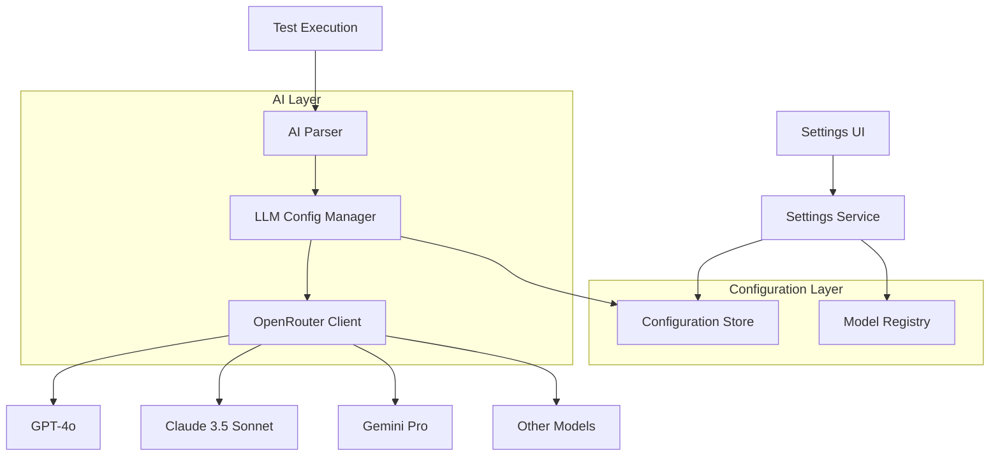

# Design Document

## Overview

设计一个完整的大模型切换系统，允许用户在设置页面选择不同的AI模型，并实时生效于测试解析功能。系统将通过OpenRouter API统一调用不同的AI模型，保持提示词逻辑一致性，同时支持模型特定的参数配置。

## Architecture

### 系统架构图



### 核心组件

1. **Settings Service**: 管理配置的读取、保存和验证
2. **Model Registry**: 维护支持的模型列表和默认参数
3. **LLM Config Manager**: 管理当前活跃的模型配置
4. **OpenRouter Client**: 统一的API调用客户端

## Components and Interfaces

### 1. Model Registry Interface

```typescript
interface ModelDefinition {
  id: string;
  name: string;
  provider: string;
  openRouterModel: string;
  defaultConfig: {
    temperature: number;
    maxTokens: number;
    topP?: number;
  };
  capabilities: string[];
  description: string;
}

interface ModelRegistry {
  getAvailableModels(): ModelDefinition[];
  getModelById(id: string): ModelDefinition | null;
  getDefaultModel(): ModelDefinition;
}
```

### 2. Settings Service Interface

```typescript
interface LLMSettings {
  selectedModelId: string;
  apiKey: string;
  customConfig?: {
    temperature?: number;
    maxTokens?: number;
    topP?: number;
  };
}

interface SettingsService {
  getLLMSettings(): Promise<LLMSettings>;
  saveLLMSettings(settings: LLMSettings): Promise<void>;
  validateSettings(settings: LLMSettings): Promise<ValidationResult>;
  resetToDefaults(): Promise<void>;
}
```

### 3. LLM Config Manager Interface

```typescript
interface LLMConfigManager {
  getCurrentConfig(): LLMConfig;
  updateConfig(settings: LLMSettings): Promise<void>;
  testConnection(): Promise<boolean>;
  getModelInfo(): ModelDefinition;
}
```

### 4. Enhanced Settings UI Components

```typescript
interface ModelSelectorProps {
  selectedModel: string;
  availableModels: ModelDefinition[];
  onModelChange: (modelId: string) => void;
}

interface ModelConfigPanelProps {
  model: ModelDefinition;
  config: LLMSettings['customConfig'];
  onConfigChange: (config: LLMSettings['customConfig']) => void;
}
```

## Data Models

### 1. 配置存储结构

```typescript
// localStorage/database schema
interface StoredSettings {
  llm: {
    selectedModelId: string;
    apiKey: string;
    customConfigs: Record<string, {
      temperature?: number;
      maxTokens?: number;
      topP?: number;
    }>;
  };
  system: {
    timeout: number;
    maxConcurrency: number;
    logRetentionDays: number;
  };
}
```

### 2. 模型注册表

```typescript
const MODEL_REGISTRY: ModelDefinition[] = [
  {
    id: 'gpt-4o',
    name: 'GPT-4o',
    provider: 'OpenAI',
    openRouterModel: 'openai/gpt-4o',
    defaultConfig: {
      temperature: 0.3,
      maxTokens: 1500
    },
    capabilities: ['text-generation', 'multimodal', 'reasoning', 'code-analysis'],
    description: 'OpenAI GPT-4o模型，支持文本和图像理解'
  },
  {
    id: 'deepseek-chat-v3',
    name: 'DeepSeek Chat V3',
    provider: 'DeepSeek',
    openRouterModel: 'deepseek/deepseek-chat-v3-0324',
    defaultConfig: {
      temperature: 0.2,
      maxTokens: 2000
    },
    capabilities: ['text-generation', 'reasoning', 'code-analysis', 'chinese-friendly'],
    description: 'DeepSeek聊天模型，高性价比，中文友好'
  }
];
```

## Error Handling

### 1. 配置验证错误

```typescript
interface ValidationError {
  field: string;
  message: string;
  code: string;
}

interface ValidationResult {
  isValid: boolean;
  errors: ValidationError[];
}
```

### 2. 模型切换错误处理

- **API Key无效**: 显示具体错误信息，提示用户检查密钥
- **模型不可用**: 自动回退到上一个工作模型
- **网络错误**: 显示重试选项，保持当前配置
- **参数验证失败**: 高亮错误字段，显示有效范围

### 3. 错误恢复策略

```typescript
interface ErrorRecoveryStrategy {
  onConfigError: () => Promise<void>; // 回退到默认配置
  onModelUnavailable: (modelId: string) => Promise<string>; // 切换到备用模型
  onApiError: (error: Error) => Promise<boolean>; // 重试逻辑
}
```

## Testing Strategy

### 1. 单元测试

- **Model Registry**: 测试模型定义的完整性和查询功能
- **Settings Service**: 测试配置的保存、读取和验证
- **LLM Config Manager**: 测试配置更新和连接测试
- **UI Components**: 测试用户交互和状态管理

### 2. 集成测试

- **端到端配置流程**: 从UI设置到AI解析的完整流程
- **模型切换测试**: 验证不同模型间的无缝切换
- **错误恢复测试**: 测试各种错误场景的处理

### 3. 性能测试

- **配置加载性能**: 测试设置页面的加载速度
- **模型切换延迟**: 测量模型切换的响应时间
- **API调用性能**: 比较不同模型的响应时间

### 4. 用户体验测试

- **设置界面可用性**: 确保设置流程直观易用
- **错误信息清晰度**: 验证错误提示的准确性和有用性
- **状态反馈**: 确保用户能清楚了解当前状态

## Implementation Notes

### 1. 配置持久化

- 使用localStorage作为主要存储，支持导入/导出
- 考虑未来扩展到服务器端配置同步
- 实现配置版本管理，支持平滑升级

### 2. 安全考虑

- API Key加密存储
- 敏感信息不在日志中输出
- 配置验证防止注入攻击

### 3. 性能优化

- 模型配置缓存，避免重复加载
- 懒加载模型列表，提升初始化速度
- 配置变更防抖，避免频繁保存

### 4. 扩展性设计

- 插件化模型注册机制
- 支持自定义模型添加
- 配置模板系统，支持快速切换场景