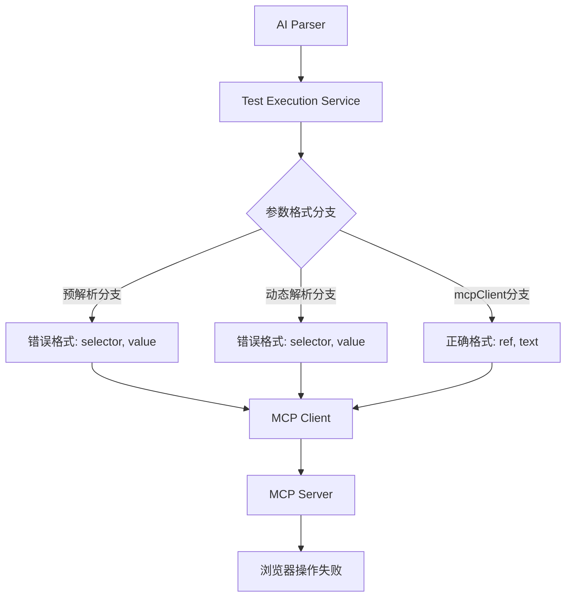
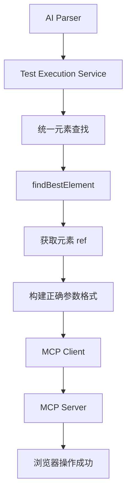

# MCP 参数格式修复设计文档

## 概述

本设计文档详细描述了如何修复 Sakura AI 系统中 MCP 工具调用参数格式不一致的问题。主要目标是统一所有 MCP 工具调用的参数格式，确保浏览器操作能够正常执行。

## 架构

### 当前架构问题



### 修复后架构



## 组件和接口

### 1. TestExecutionService 修改

#### 修改的方法：
- `executeMcpCommand`: 统一参数格式处理逻辑
- 新增辅助方法：`findElementAndBuildCommand`

#### 接口变更：
```typescript
interface MCPCommandParams {
  // 点击操作参数
  click: { ref: string };
  // 输入操作参数  
  type: { ref: string; text: string };
  // 等待操作参数
  wait: { timeout: number };
  // 断言操作参数
  expect: { selector: string; condition: string; text: string };
}
```

### 2. 元素查找统一接口

```typescript
interface ElementReference {
  ref: string;
  text: string;
  confidence?: number;
}

interface ElementFinder {
  findBestElement(selector: string, runId: string): Promise<ElementReference>;
}
```

### 3. 参数转换器

```typescript
interface ParameterConverter {
  convertToMCPFormat(
    action: string, 
    params: any, 
    elementRef?: ElementReference
  ): MCPCommandParams[keyof MCPCommandParams];
}
```

## 数据模型

### MCP 工具参数映射

| 操作类型 | 工具名称 | 旧参数格式 | 新参数格式 |
|---------|---------|-----------|-----------|
| 点击 | browser_click | `{ selector: string }` | `{ ref: string }` |
| 输入 | browser_type | `{ selector: string, value: string }` | `{ ref: string, text: string }` |
| 等待 | browser_wait_for | `{ timeout: number }` | `{ timeout: number }` (无变化) |
| 断言 | browser_snapshot | `{ selector: string, condition: string, text: string }` | 保持不变 |

### 错误处理数据模型

```typescript
interface MCPExecutionError {
  type: 'ELEMENT_NOT_FOUND' | 'PARAMETER_FORMAT_ERROR' | 'MCP_CALL_FAILED';
  message: string;
  details: {
    selector?: string;
    expectedFormat?: any;
    actualFormat?: any;
    runId: string;
  };
}
```

## 错误处理

### 错误类型和处理策略

1. **元素查找失败**
   - 记录详细的选择器信息
   - 尝试备用选择器策略
   - 提供清晰的错误消息

2. **参数格式转换失败**
   - 记录转换前后的参数对比
   - 回退到安全的默认参数
   - 通知用户参数格式问题

3. **MCP 调用失败**
   - 记录完整的调用参数
   - 实施重试机制
   - 提供调试信息

### 错误恢复机制

```typescript
async function executeWithFallback(
  primaryCommand: MCPCommand,
  fallbackStrategies: MCPCommand[]
): Promise<MCPExecutionResult> {
  try {
    return await executeMCPCommand(primaryCommand);
  } catch (error) {
    for (const fallback of fallbackStrategies) {
      try {
        return await executeMCPCommand(fallback);
      } catch (fallbackError) {
        console.warn(`Fallback failed: ${fallbackError.message}`);
      }
    }
    throw error;
  }
}
```

## 测试策略

### 单元测试

1. **参数格式转换测试**
   ```typescript
   describe('Parameter Format Conversion', () => {
     it('should convert fill parameters correctly', () => {
       const result = convertToMCPFormat('fill', 
         { selector: 'input[name="username"]', value: 'admin' },
         { ref: 'e18', text: 'Username' }
       );
       expect(result).toEqual({ ref: 'e18', text: 'admin' });
     });
   });
   ```

2. **元素查找测试**
   ```typescript
   describe('Element Finding', () => {
     it('should find element by natural language description', async () => {
       const element = await findBestElement('用户名输入框', 'test-run-1');
       expect(element.ref).toBeDefined();
       expect(element.text).toContain('用户名');
     });
   });
   ```

### 集成测试

1. **端到端 MCP 调用测试**
   - 验证完整的参数格式转换流程
   - 确保浏览器操作实际执行
   - 检查日志输出格式

2. **回归测试**
   - 确保现有功能不受影响
   - 验证所有测试用例继续工作
   - 检查性能影响

### 测试数据

```typescript
const testCases = [
  {
    description: '在用户名字段输入 "admin"',
    expectedMCPCall: {
      name: 'browser_type',
      arguments: { ref: 'e18', text: 'admin' }
    }
  },
  {
    description: '点击登录按钮',
    expectedMCPCall: {
      name: 'browser_click', 
      arguments: { ref: 'e19' }
    }
  }
];
```

## 实现细节

### 修复步骤

1. **第一阶段：修复预解析分支**
   - 修改 `executeMcpCommand` 中的参数构建逻辑
   - 添加元素查找步骤
   - 更新参数格式

2. **第二阶段：修复动态解析分支**
   - 统一动态解析的参数格式
   - 确保与预解析分支一致
   - 添加错误处理

3. **第三阶段：增强日志和调试**
   - 改进日志输出格式
   - 添加参数格式验证
   - 增强错误信息

### 关键代码修改点

1. **testExecution.ts 第 360-370 行**：预解析分支参数构建
2. **testExecution.ts 第 440 行**：动态解析分支参数构建  
3. **新增辅助方法**：统一的元素查找和参数转换逻辑

### 向后兼容性保证

- 保持 `mcpClient.ts` 中现有的正确实现不变
- 确保所有现有 API 接口保持兼容
- 添加渐进式的错误处理和回退机制

## 性能考虑

### 优化策略

1. **元素查找缓存**
   - 在同一个测试运行中缓存元素查找结果
   - 避免重复的快照获取和解析

2. **参数格式验证**
   - 在开发模式下启用严格验证
   - 在生产模式下使用轻量级检查

3. **错误处理优化**
   - 快速失败策略避免长时间等待
   - 智能重试避免无效的重复尝试

### 监控指标

- MCP 调用成功率
- 元素查找成功率  
- 参数格式转换耗时
- 错误恢复成功率

这个设计确保了 MCP 参数格式的统一性，同时保持了系统的稳定性和可维护性。