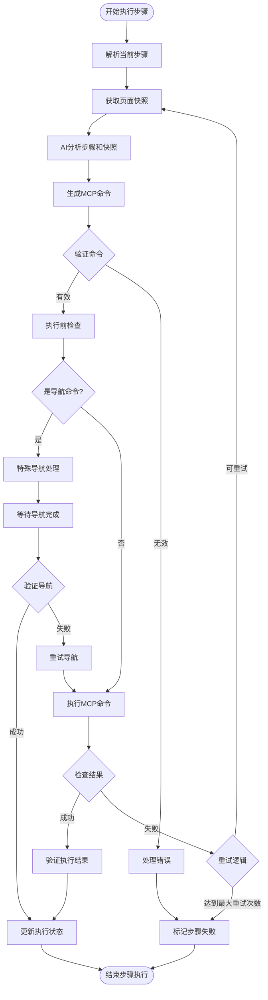
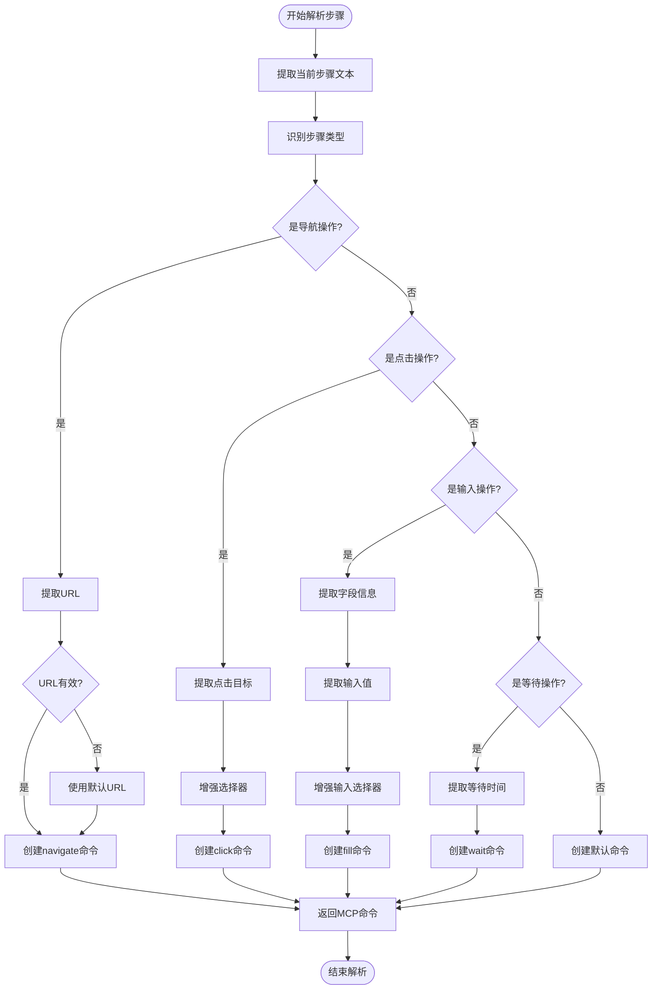
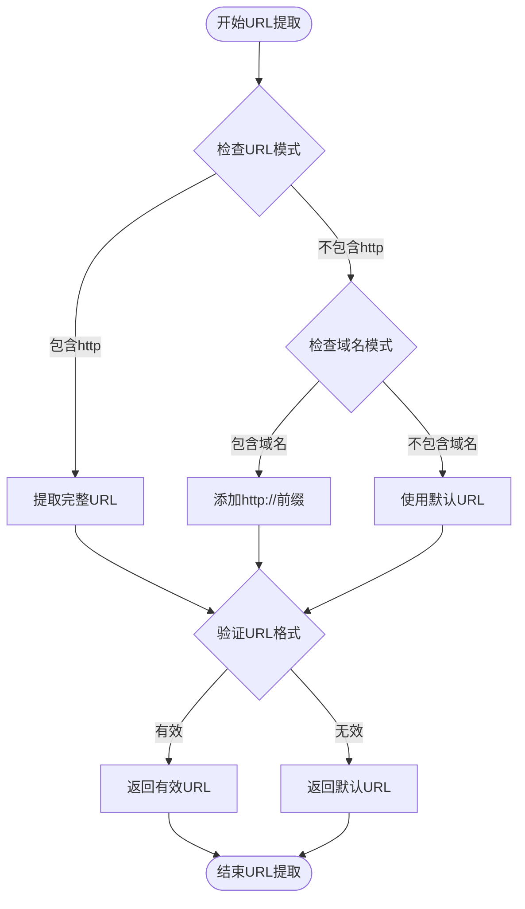
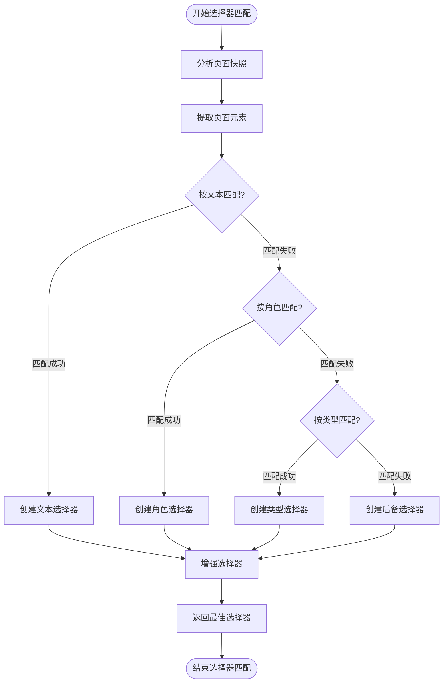
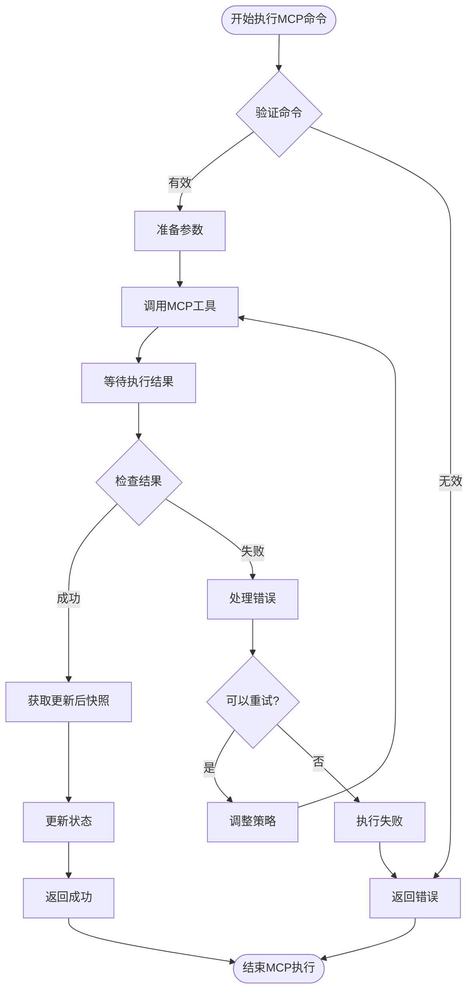
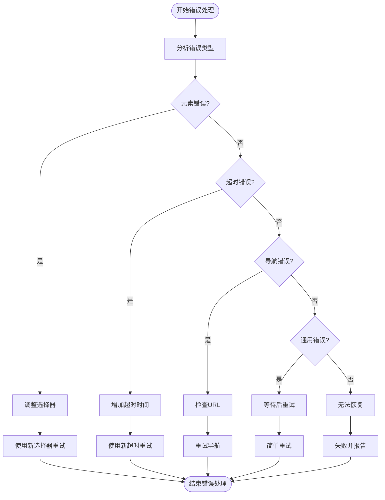

# MCP执行流程图

本文档详细描述Sakura AI自动化测试平台中MCP（Model Context Protocol）执行的完整流程，包括步骤解析、命令生成、执行和结果处理。

## MCP执行主流程

## 步骤解析详细流程

## URL提取逻辑改进

当前的URL提取逻辑存在问题，无法正确从步骤描述中提取完整URL。以下是改进的URL提取流程：

## 选择器智能匹配流程

## MCP命令执行流程

## 错误处理和重试机制

## 关键改进点

1. **URL提取逻辑**：
   - 当前正则表达式 `/https?:\/\/[^\s\u4e00-\u9fff]+/` 无法正确处理中文URL或带路径的URL
   - 改进为 `/https?:\/\/[^\s]+/` 以捕获完整URL，包括路径部分

2. **步骤解析逻辑**：
   - 当前解析逻辑对于"1、进入网站https://..."格式的步骤无法正确识别为导航操作
   - 需要增强步骤类型识别，优先检查是否包含URL，而不仅依赖关键词

3. **选择器增强**：
   - 当前选择器过于简单，导致无法准确定位元素
   - 需要实现多层次选择器策略，包括文本、角色、类型和属性组合

4. **快照分析**：
   - 当前快照分析不充分，未能从快照中提取有用信息辅助选择器生成
   - 需要增强快照解析能力，提取页面结构和元素特征

5. **错误恢复**：
   - 当前错误处理机制简单，缺乏针对性恢复策略
   - 需要实现基于错误类型的智能恢复机制

## MCP 参数格式修复 (已完成)

6. **MCP 参数格式统一**：
   - **问题**：系统中存在两种不同的参数格式，导致浏览器操作失败
     - 错误格式：`browser_type { selector: "input[name='username']", value: "admin" }`
     - 正确格式：`browser_type { ref: "e18", text: "admin" }`
   - **解决方案**：
     - 统一所有 MCP 工具调用使用 `ref` 和 `text` 参数格式
     - 在执行操作前先通过 `findBestElement` 获取元素引用
     - 添加参数格式验证和错误处理机制
   - **修复范围**：
     - `testExecution.ts` 中的预解析分支和动态解析分支
     - 添加统一的元素查找和参数转换辅助方法
     - 增强错误处理和日志记录功能

7. **参数格式规范**：
   - **点击操作**：`browser_click { ref: "elementRef" }`
   - **输入操作**：`browser_type { ref: "elementRef", text: "inputValue" }`
   - **等待操作**：`browser_wait_for { timeout: milliseconds }`
   - **导航操作**：`browser_navigate { url: "targetUrl" }`

8. **验证和测试**：
   - 添加了完整的单元测试覆盖参数格式转换功能
   - 创建了专门的验证脚本 `verify-mcp-parameter-fix.js`
   - 实现了参数格式验证和错误恢复机制

这些流程图和改进点将帮助开发团队理解MCP执行过程中的关键环节，并针对性地解决当前存在的问题。