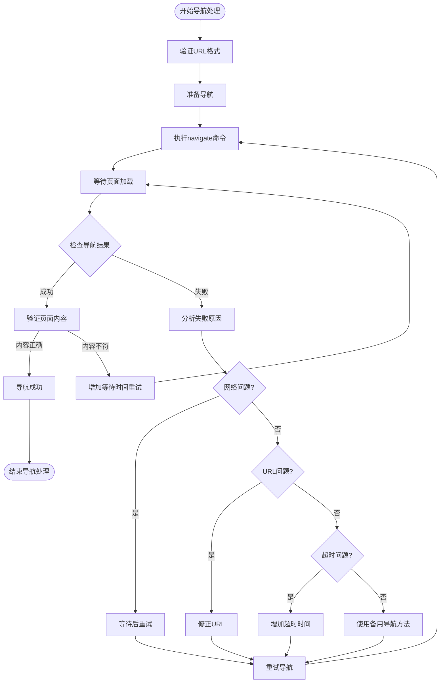

# 导航处理机制改进

## 导航问题分析

在当前的Ai Web Test自动化测试平台中，我们发现导航命令执行后页面仍停留在`about:blank`，这表明导航命令虽然被正确生成，但执行过程中存在问题。通过分析日志，我们发现以下可能的原因：

1. **导航命令执行后没有等待页面加载完成**
2. **导航结果验证不充分**
3. **可能存在网络连接问题**
4. **URL格式可能不正确**
5. **MCP工具调用成功但实际导航失败**

## 导航处理流程



## 导航命令增强实现

为了解决导航问题，我们需要对导航命令执行进行特殊处理：

1. **URL验证与修正**：
   - 确保URL格式正确（包含协议、域名等）
   - 处理相对URL和特殊字符

2. **导航执行增强**：
   - 使用`browser_navigate`命令执行导航
   - 设置适当的超时时间
   - 等待页面加载完成

3. **导航结果验证**：
   - 获取导航后的页面URL
   - 验证页面标题或特定内容
   - 确认页面已完全加载

4. **错误恢复策略**：
   - 网络问题：等待后重试
   - URL问题：尝试修正URL格式
   - 超时问题：增加等待时间
   - 其他问题：使用备用导航方法

## 导航命令执行代码示例

```typescript
// 🔥 增强的导航命令执行
private async executeNavigationCommand(url: string, runId: string): Promise<{ success: boolean; error?: string }> {
  try {
    // 1. 验证和修正URL
    const validatedUrl = this.validateAndFixUrl(url);
    console.log(`🌐 [${runId}] 导航到: ${validatedUrl}`);
    
    // 2. 执行导航命令
    await this.mcpClient.callTool({
      name: 'navigate',
      arguments: { url: validatedUrl }
    });
    
    // 3. 等待页面加载
    console.log(`⏳ [${runId}] 等待页面加载...`);
    await new Promise(resolve => setTimeout(resolve, 3000));
    
    // 4. 验证导航结果
    const snapshot = await this.mcpClient.getSnapshot();
    const currentUrl = this.extractUrlFromSnapshot(snapshot);
    
    // 5. 检查导航是否成功
    if (currentUrl && currentUrl !== 'about:blank') {
      console.log(`✅ [${runId}] 导航成功: ${currentUrl}`);
      return { success: true };
    } else {
      console.log(`⚠️ [${runId}] 导航可能未完成，当前URL: ${currentUrl || 'unknown'}`);
      
      // 6. 重试导航
      console.log(`🔄 [${runId}] 重试导航...`);
      await this.mcpClient.callTool({
        name: 'navigate',
        arguments: { url: validatedUrl }
      });
      
      // 7. 增加等待时间
      console.log(`⏳ [${runId}] 增加等待时间...`);
      await new Promise(resolve => setTimeout(resolve, 5000));
      
      // 8. 再次验证
      const newSnapshot = await this.mcpClient.getSnapshot();
      const newUrl = this.extractUrlFromSnapshot(newSnapshot);
      
      if (newUrl && newUrl !== 'about:blank') {
        console.log(`✅ [${runId}] 重试导航成功: ${newUrl}`);
        return { success: true };
      } else {
        // 9. 尝试备用导航方法
        console.log(`🔄 [${runId}] 尝试备用导航方法...`);
        
        try {
          // 使用browser_type输入URL并按Enter
          await this.mcpClient.callTool({
            name: 'type',
            arguments: { selector: 'body', text: validatedUrl }
          });
          
          await this.mcpClient.callTool({
            name: 'press_key',
            arguments: { key: 'Enter' }
          });
        } catch (backupError) {
          console.log(`⚠️ [${runId}] 备用导航方法失败: ${backupError.message}`);
          
          // 10. 尝试直接使用browser_navigate
          console.log(`🔄 [${runId}] 尝试直接使用browser_navigate...`);
          await this.mcpClient.callTool({
            name: 'browser_navigate',
            arguments: { url: validatedUrl }
          });
        }
        
        // 11. 再次等待和验证
        await new Promise(resolve => setTimeout(resolve, 5000));
        const finalSnapshot = await this.mcpClient.getSnapshot();
        const finalUrl = this.extractUrlFromSnapshot(finalSnapshot);
        
        if (finalUrl && finalUrl !== 'about:blank') {
          console.log(`✅ [${runId}] 备用导航方法成功: ${finalUrl}`);
          return { success: true };
        } else {
          console.log(`❌ [${runId}] 导航失败，无法访问: ${validatedUrl}`);
          return { success: false, error: `无法导航到 ${validatedUrl}` };
        }
      }
    }
  } catch (error: any) {
    console.error(`❌ [${runId}] 导航执行错误: ${error.message}`);
    return { success: false, error: error.message };
  }
}

// 验证和修正URL
private validateAndFixUrl(url: string): string {
  // 确保URL有协议前缀
  if (!url.startsWith('http://') && !url.startsWith('https://')) {
    url = 'https://' + url;
  }
  
  // 处理特殊字符
  try {
    new URL(url); // 验证URL格式
    return url;
  } catch (e) {
    // 如果URL格式不正确，尝试修复
    return encodeURI(url);
  }
}

// 从快照中提取URL
private extractUrlFromSnapshot(snapshot: string): string | null {
  if (!snapshot) return null;
  const urlMatch = snapshot.match(/Page URL: ([^\n]+)/);
  return urlMatch ? urlMatch[1].trim() : null;
}
```

## 导航问题排查清单

当导航命令执行后页面仍停留在`about:blank`时，可按以下步骤排查：

1. **检查URL格式**：确保URL包含协议前缀(http://或https://)
2. **验证网络连接**：确认目标网站可访问
3. **检查MCP工具调用**：确认`browser_navigate`命令执行成功
4. **增加等待时间**：页面加载可能需要更长时间
5. **检查浏览器状态**：确认浏览器窗口正常显示
6. **尝试备用导航方法**：如使用`browser_type`输入URL后按Enter
7. **检查日志**：查看详细错误信息
8. **验证目标网站兼容性**：某些网站可能有反自动化措施

通过实施这些改进，我们可以显著提高导航命令的成功率，确保测试用例能够正确执行。