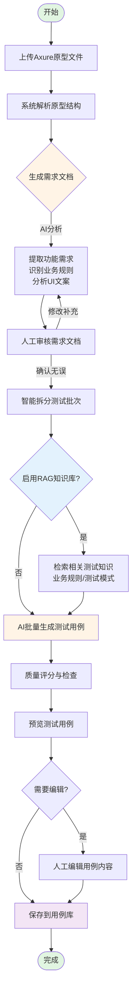
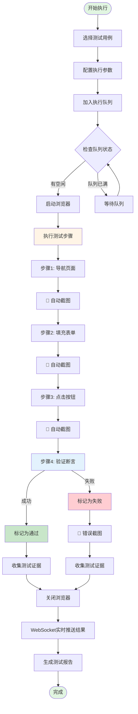
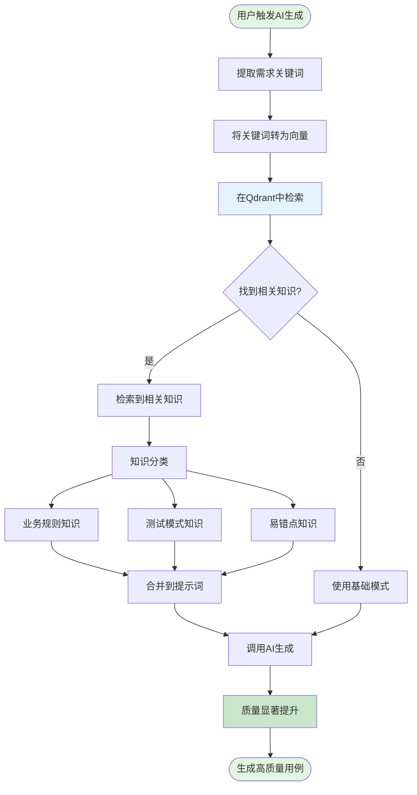

# Sakura AI 操作员培训手册

<div align="center">

**版本**: 3.0.0
**更新日期**: 2025-11-14
**适用对象**: 测试操作员、QA新人
**培训时长**: 建议 2-3 小时

</div>

---

## 📋 培训大纲

**本手册重点讲解三大核心功能:**

1. [**AI测试用例生成** - 从Axure原型自动生成测试用例](#第一部分ai测试用例生成)
2. [**UI自动化测试执行** - 浏览器自动化测试运行](#第二部分ui自动化测试执行)
3. [**知识库管理** - 提升AI生成质量的秘密武器](#第三部分知识库管理)

**附加章节:**
- [快速上手指南](#快速上手指南)
- [常见问题解答](#常见问题解答)

---

## 快速上手指南

### 系统访问

**访问地址**: `http://localhost:5173`

**首次登录**:
- 用户名: `admin`
- 密码: `admin123`

> ⚠️ **重要**: 首次登录后请立即修改密码!
> 路径: 右上角头像 → 设置 → 账号安全 → 修改密码

### 推荐浏览器

| 浏览器 | 最低版本 | 推荐版本 |
|--------|---------|---------|
| Chrome | 90+ | 最新版 ✓ |
| Edge | 90+ | 最新版 ✓ |
| Firefox | 88+ | 最新版 |

---

## 第一部分:AI测试用例生成

### 📌 章节概述

**学习目标**:
- 理解AI用例生成的工作原理
- 掌握从Axure原型生成测试用例的完整流程
- 学会优化生成质量

**预计学习时间**: 60分钟

---

### 1.1 工作原理(流程图)



**流程说明**:

| 阶段 | 操作 | 时间 | AI参与 |
|------|------|------|--------|
| ① 上传原型 | 选择Axure HTML文件 | 10秒 | ❌ |
| ② 解析结构 | 自动识别页面和交互 | 10-20秒 | ✅ |
| ③ 生成需求 | AI分析并生成需求文档 | 30-60秒 | ✅ |
| ④ 审核需求 | 人工检查和补充 | 5-10分钟 | ❌ |
| ⑤ 批次规划 | 智能拆分测试任务 | 5秒 | ✅ |
| ⑥ RAG检索 | 查询知识库(可选) | 10-30秒 | ✅ |
| ⑦ 生成用例 | 批量生成测试用例 | 1-3分钟 | ✅ |
| ⑧ 质量检查 | 评分并预览 | 10秒 | ✅ |
| ⑨ 保存用例 | 存入测试用例库 | 5秒 | ❌ |

**总耗时**: 约 **10-15分钟** 完成 50-100 个测试用例

---

### 1.2 核心价值

**效率对比**:

| 方式 | 100个用例耗时 | 人力成本 | 质量评分 |
|------|--------------|---------|---------|
| **传统手写** | 2-3天 | 1人×2-3天 | 70-85分 |
| **AI生成(无RAG)** | 15分钟 | 1人×15分钟 | 75-88分 |
| **AI生成(有RAG)** | 20分钟 | 1人×20分钟 | 85-95分 ⭐ |

**效率提升**: **20-50倍** 🚀
**成本节省**: **80-90%** 💰

---

### 1.3 完整操作步骤

#### 步骤1: 准备Axure原型

**支持的文件格式**:
- ✅ `.html` / `.htm` (Axure RP 8/9/10 导出)
- ✅ 文件大小: 最大 50MB
- ❌ `.rp` 源文件(必须先导出为HTML)

**Axure导出步骤**:
```
Axure RP → 发布 → 生成HTML文件 → 选择本地文件夹 → 生成
```

**原型质量要求** ⭐:

| 项目 | 要求 | 示例 |
|------|------|------|
| **页面命名** | 清晰规范 | ✅ "用户登录页" ❌ "page1" |
| **交互逻辑** | 完整业务流程 | ✅ 点击登录→验证→跳转首页 |
| **关键元素** | 准确命名 | ✅ "登录按钮" ❌ "矩形1" |
| **业务规则** | 注释说明 | ✅ "密码至少8位" |

---

#### 步骤2: 上传原型并生成需求文档

**访问AI生成器**:
```
导航路径: 功能测试用例 → AI生成器
或直接访问: http://localhost:5173/functional-test-cases/generator
```

**上传文件**:
1. 点击上传区域或拖拽文件
2. 等待解析(10-20秒)
3. 查看原型信息:
   ```
   📄 文件名: 电商系统原型.html
   📏 文件大小: 8.5 MB
   📊 页面数量: 23个页面
   🔗 交互数量: 156个交互
   ```

**生成需求文档**:
1. 点击「生成需求文档」按钮
2. AI分析(30-60秒)
3. 查看生成的需求文档

**需求文档包含**:

| 章节 | 内容 | 重要性 |
|------|------|--------|
| 1. 系统概述 | 系统功能和目标 | ⭐⭐⭐ |
| 2. 功能需求 | 详细功能点描述 | ⭐⭐⭐⭐⭐ |
| 3. 页面布局与文案 | UI元素验证 | ⭐⭐⭐⭐ |
| 4. 业务规则 | 验证规则边界 | ⭐⭐⭐⭐⭐ |
| 5. 非功能需求 | 性能/安全 | ⭐⭐⭐ |

**⭐ 审核并编辑需求文档(重要)**:

建议花 **5-10分钟** 仔细审核:

1. ✅ 补充边界条件
   ```
   原AI生成: "用户名必填"
   建议补充: "用户名4-20个字符,支持字母、数字、下划线"
   ```

2. ✅ 明确异常场景
   ```
   补充:
   - 用户名为空时,提示"请输入用户名"
   - 密码错误时,提示"用户名或密码错误"
   ```

3. ✅ 添加业务规则
   ```
   补充:
   - 密码输入框显示为 ***
   - 支持Enter键快捷登录
   ```

完成后点击「下一步:生成测试用例」

---

#### 步骤3: 批量生成测试用例

**智能批次规划**:
```
📦 批次规划示例:

├─ 批次 1: 用户登录与注册 (8个功能点)
│   预计生成: 12-15个测试用例
├─ 批次 2: 商品浏览与搜索 (12个功能点)
│   预计生成: 18-22个测试用例
├─ 批次 3: 购物车管理 (10个功能点)
│   预计生成: 15-18个测试用例
└─ 批次 4: 订单提交与支付 (15个功能点)
    预计生成: 22-28个测试用例

总计: 预计生成 75-95 个测试用例
```

**启动生成**:
1. 点击「开始生成测试用例」
2. 查看实时进度:
   ```
   正在生成批次 2/4 (进度: 50%)
   ✓ 批次 1 已完成 (12个用例) ✅
   ⏳ 批次 2 生成中... (预计45秒)
   ```

**RAG知识库增强**(如已启用):
```
🔍 [RAG模式] 知识库检索中...
✓ 检索到业务规则: 2条
✓ 检索到测试模式: 3条
✓ 检索到易错点: 1条
🎯 使用知识库增强模式生成测试用例
```

**查看生成结果**:
```
✅ 测试用例生成完成!

总计: 87 个测试用例
平均质量评分: 91/100
耗时: 02:45
```

**预览测试用例**:

每个测试用例包含:
- 用例名称: "测试用户登录-正常流程"
- 优先级: High
- 质量评分: 95/100
- 前置条件: "用户已注册"
- 测试步骤: 5-10个步骤(JSON格式)
- 预期结果: 每步的验证点
- 标签: [登录, 认证]

**保存到用例库**:
1. 全选用例(或手动勾选)
2. 点击「保存到用例库(87)」
3. 系统提示保存成功

---

### 1.4 最佳实践

**✅ 推荐做法**:
1. 原型命名规范,避免page1/page2
2. 仔细审核需求文档(5-10分钟)
3. 启用RAG知识库提升质量
4. 检查质量评分(建议≥80分)

**❌ 常见错误**:
1. ❌ 原型过于粗糙
2. ❌ 不审查需求就直接生成
3. ❌ 忽略质量评分低的用例

---

## 第二部分:UI自动化测试执行

### 📌 章节概述

**学习目标**:
- 理解UI自动化测试的工作原理
- 掌握单个用例和批量测试的执行方法
- 学会查看和分析测试结果

**预计学习时间**: 45分钟

---

### 2.1 工作原理(流程图)



**技术架构说明**:

```
┌─────────────────────────────────────┐
│       前端 (React)                  │
│  - 用例管理界面                      │
│  - 实时监控面板                      │
│  - WebSocket客户端                  │
└──────────────┬──────────────────────┘
               │ HTTP/WebSocket
               ↓
┌─────────────────────────────────────┐
│   后端 (Node.js + Express)          │
│  - 测试执行引擎                      │
│  - 队列管理器                        │
│  - WebSocket服务                    │
└──────────────┬──────────────────────┘
               │
               ↓
┌─────────────────────────────────────┐
│   Playwright 浏览器自动化            │
│  - 页面操作(点击/填充/导航)          │
│  - 元素定位(CSS/XPath)              │
│  - 断言验证                          │
└──────────────┬──────────────────────┘
               │
               ↓
┌─────────────────────────────────────┐
│   被测应用 (Web应用)                 │
└─────────────────────────────────────┘
```

**执行时间线**:

| 阶段 | 时间 | 说明 |
|------|------|------|
| 加入队列 | 即时 | 任务加入等待队列 |
| 启动浏览器 | 2-5秒 | 初始化Playwright |
| 执行步骤 | 30秒-3分钟 | 根据步骤数量 |
| 截图收集 | 0.5秒/张 | 每步自动截图 |
| 断言验证 | 1-3秒/步 | 验证页面状态 |
| 关闭浏览器 | 1-2秒 | 释放资源 |
| 生成报告 | 1秒 | 保存到数据库 |

**总耗时**: 单个测试 **1-5分钟**

---

### 2.2 执行单个测试用例

**快速执行**:
```
导航路径: 测试用例管理 → 选择用例 → 点击「执行」
```

**执行配置**:

| 参数 | 说明 | 默认值 |
|------|------|--------|
| 执行环境 | 测试目标URL | 测试环境 |
| 浏览器类型 | chromium/firefox/webkit | chromium |
| 可见模式 | 显示浏览器窗口 | 否 |
| 超时时间 | 单步最大等待(毫秒) | 30000 |
| 失败重试 | 失败后重试次数 | 0 |

**实时监控**:
```
┌─────────────────────────────────────┐
│ 测试执行中            [停止测试]    │
├─────────────────────────────────────┤
│ 📝 测试名称: 测试登录-正常流程      │
│ 🟢 执行状态: 运行中                 │
│ 📊 进度: 3/5 (60%)                  │
│ ✅ 已通过: 3步                       │
│ ❌ 已失败: 0步                       │
│ ⏱️ 执行时间: 00:01:23               │
└─────────────────────────────────────┘
```

**查看测试结果**(4个标签页):

1. **📝 执行日志**: 完整步骤日志
2. **🎥 实时画面**: 浏览器视频流(执行中)
3. **📸 测试证据**: 每步自动截图
4. **⏳ 队列状态**: 当前队列情况

---

### 2.3 批量执行测试套件

**创建测试套件**:
```
导航路径: 测试套件 → 创建套件
```

配置项:
- 套件名称: "用户登录注册回归测试"
- 选择用例: 10-50个
- 执行顺序: 按优先级
- 并发数: 3-6(推荐)
- 失败后: 继续执行/立即停止

**执行套件**:
```
导航路径: 测试套件 → 选择套件 → 批量执行
```

**批量监控**:
```
┌─────────────────────────────────────┐
│ 套件: 登录注册回归    [停止所有]    │
├─────────────────────────────────────┤
│ 📊 总体进度: 7/15 (47%)              │
│ ✅ 已通过: 6个                       │
│ ❌ 已失败: 1个                       │
│ 🟢 执行中: 4个                       │
│ ⏳ 等待中: 4个                       │
│ ⏱️ 执行时间: 00:05:42               │
└─────────────────────────────────────┘
```

---

### 2.4 最佳实践

**✅ 推荐做法**:
1. 确保测试环境稳定
2. 合理配置并发数:
   - 8GB内存: 并发3-4
   - 16GB内存: 并发6-8
3. 偶发失败配置重试1-2次
4. 定期清理历史截图(保留30天)

**❌ 常见错误**:
1. ❌ 并发数过高导致失败
2. ❌ 不维护测试数据
3. ❌ 不查看失败日志直接重跑

---

## 第三部分:知识库管理

### 📌 章节概述

**学习目标**:
- 理解RAG知识库的工作原理
- 掌握知识库的导入和维护方法
- 学会优化AI生成质量

**预计学习时间**: 30分钟

---

### 3.1 RAG知识库工作原理



**RAG检索过程示例**:

```
输入需求: "用户登录功能测试"

Step 1: 关键词提取
提取: ["用户登录", "登录功能", "验证", "认证"]

Step 2: 向量化
用户登录 → [0.23, -0.45, 0.67, ..., 0.12] (768维向量)

Step 3: 向量检索
在Qdrant中搜索最相似的前5条知识

Step 4: 检索结果
✓ 业务规则: "登录密码至少8位,包含字母和数字"
✓ 测试模式: "登录功能完整测试模式(正常+异常+边界)"
✓ 易错点: "特殊字符导致登录失败"

Step 5: 合并到AI提示词
系统提示词 + 需求文档 + 检索到的知识 → AI模型

Step 6: 生成高质量用例
AI根据增强后的上下文生成测试用例
```

**RAG增强效果**:

| 指标 | 无RAG | 有RAG | 提升 |
|------|-------|-------|------|
| 测试覆盖率 | 70-80% | 85-95% | +15-25% |
| 专业准确性 | 75-85% | 90-95% | +15-20% |
| 边界值覆盖 | 40-50% | 80-95% | +40-55% |
| 异常场景覆盖 | 50-60% | 80-90% | +30-40% |

---

### 3.2 启用RAG知识库

#### 步骤1: 启动Qdrant向量数据库

**Docker启动(推荐)**:
```bash
# 启动Qdrant容器
docker run -d -p 6333:6333 \
  --name qdrant \
  -v $(pwd)/qdrant_storage:/qdrant/storage \
  qdrant/qdrant

# 验证启动
docker ps | grep qdrant

# 访问Dashboard
# 浏览器打开: http://localhost:6333/dashboard
```

#### 步骤2: 配置Embedding API

编辑 `.env` 文件:

```bash
# Qdrant配置
QDRANT_URL=http://localhost:6333
QDRANT_COLLECTION_NAME=test_knowledge

# Embedding提供商(二选一)

# 选项1: 阿里云通义千问(推荐,国内访问快)
EMBEDDING_PROVIDER=aliyun
ALIYUN_API_KEY=sk-your-aliyun-api-key
ALIYUN_EMBEDDING_MODEL=text-embedding-v3

# 选项2: OpenAI
EMBEDDING_PROVIDER=openai
OPENAI_API_KEY=sk-your-openai-api-key
OPENAI_EMBEDDING_MODEL=text-embedding-3-small
```

**获取API Key**:

**阿里云通义千问**:
1. 访问: https://dashscope.console.aliyun.com/
2. 注册/登录阿里云账号
3. 开通DashScope服务
4. 创建API Key
5. 复制到 `.env`

#### 步骤3: 验证RAG配置

重启后端:
```bash
npm run dev:server
```

查看日志:
```
[服务启动] Sakura AI服务已启动
[Qdrant] 连接成功: http://localhost:6333
[Qdrant] Collection: test_knowledge
[Embedding] 提供商: aliyun
[RAG] 知识库已启用 ✅
```

---

### 3.3 知识库导入

#### 添加单条知识

```
导航路径: 知识管理 → 测试知识库 → 添加知识
```

**字段说明**:

| 字段 | 说明 | 示例 |
|------|------|------|
| 知识标题 | 简洁描述 | "用户名格式验证规则" |
| 知识分类 | 业务规则/测试模式/易错点/风险场景 | 业务规则 |
| 知识内容 | 详细描述(支持Markdown) | 验证规则详情 |
| 关键词 | 帮助检索 | 用户名, 验证, 格式 |

#### 批量导入知识

**JSON格式示例**:

```json
[
  {
    "title": "用户名格式验证规则",
    "category": "业务规则",
    "content": "用户名必须满足:\n1. 长度: 4-20个字符\n2. 字符: 仅支持字母、数字、下划线\n3. 首字符: 必须是字母\n\n测试建议:\n- 正常值: test, user123\n- 边界值: abcd (4位), 12345678901234567890 (20位)\n- 异常值: 123 (太短), test@123 (特殊字符)",
    "keywords": ["用户名", "验证", "格式"]
  },
  {
    "title": "登录功能完整测试模式",
    "category": "测试模式",
    "content": "登录功能完整测试应覆盖:\n\n正常场景:\n1. 正确用户名+密码 → 登录成功\n2. 勾选"记住我" → 7天免登录\n\n异常场景:\n1. 错误密码 → 提示错误\n2. 空用户名 → 提示必填\n3. 连续失败3次 → 账号锁定\n\n边界场景:\n1. 最短/最长用户名密码\n2. 特殊字符处理",
    "keywords": ["登录", "测试模式", "完整测试"]
  }
]
```

**导入操作**:
```
导航路径: 知识管理 → 批量导入
```

1. 选择JSON/Excel文件
2. 预览数据
3. 选择重复处理策略(跳过/覆盖/重命名)
4. 点击「开始导入」

**导入结果**:
```
✅ 导入完成

成功: 4 条知识
失败: 0 条知识

向量化进度: [████████████████] 100%
所有知识已存入Qdrant
```

---

### 3.4 知识库维护

**知识库列表**:
```
导航路径: 知识管理 → 测试知识库
```

显示内容:
- 总计知识数量
- 按分类统计
- 每条知识的引用次数
- 编辑/删除操作

**最佳实践**:

**✅ 推荐做法**:
1. 知识内容准确详细
2. 使用清晰结构(列表/分段)
3. 补充测试建议和示例
4. 定期更新过时知识

**知识分类建议**:
- 业务规则: 验证规则、业务逻辑
- 测试模式: 成熟的测试方法
- 易错点: 历史缺陷、容易遗漏的场景
- 风险场景: 安全、性能相关

**关键词优化**:
- ✅ 使用业务相关关键词
- ✅ 包含同义词(如"登录"/"登陆"/"signin")
- ✅ 避免过于宽泛(如"测试")

**定期维护**:
- ✅ 每月审查知识库
- ✅ 删除过时知识
- ✅ 补充新的测试经验
- ✅ 优化引用次数低的知识

---

### 3.5 RAG检索日志

查看完整RAG检索过程:

```bash
tail -f logs/server.log | grep "RAG"

# 示例输出:
# [15:30:15] 🔍 [RAG-Step1] 提取关键词: ["用户登录", "密码验证"]
# [15:30:16] 🔍 [RAG-Step2] 向量检索完成 (耗时: 245ms)
# [15:30:16] 📊 [RAG-Step3] 业务规则: 2条, 测试模式: 1条
# [15:30:17] 🎯 [RAG-Step4] 知识库增强完成
# [15:30:17] ✨ [RAG模式] 开始生成测试用例
```

---

## 常见问题解答

### AI生成问题

**Q: 生成的测试用例质量不高?**

A:
1. 检查Axure原型质量
2. 在需求文档阶段补充业务规则
3. 启用RAG知识库增强
4. 关注质量评分(建议≥80分)

**Q: 生成速度很慢?**

A:
1. 检查AI模型连接稳定性
2. 切换到更快的模型(如DeepSeek)
3. 减少单批次用例数量

**Q: RAG知识库未生效?**

A:
1. 确认Qdrant已启动: `docker ps | grep qdrant`
2. 检查Embedding API配置: `.env`
3. 查看日志: `tail -f logs/server.log | grep "RAG"`
4. 重启后端: `npm run dev:server`

---

### 测试执行问题

**Q: 测试执行失败?**

A:
1. 查看详细错误日志和截图
2. 检查测试环境是否可用
3. 验证选择器是否正确
4. 在可见模式下调试

**Q: 测试执行很慢?**

A:
1. 减少并发数
2. 优化测试步骤
3. 检查网络连接
4. 升级服务器配置

**Q: 如何调试失败用例?**

A:
1. 启用可见模式(勾选"可见模式")
2. 观察浏览器实际操作
3. 检查元素定位器
4. 调整超时时间

---

### 系统性能问题

**Q: 系统响应慢?**

A:
1. 检查服务器资源
2. 清理历史测试数据
3. 定期清理截图(保留30天)

**Q: 浏览器崩溃?**

A:
1. 降低并发数
2. 增加服务器内存
3. 关闭不必要的浏览器标签

---

## 附录: 快速参考

### 快捷键

| 快捷键 | 功能 |
|--------|------|
| `Ctrl + S` | 保存当前编辑 |
| `Ctrl + F` | 搜索/筛选 |
| `Ctrl + N` | 新建用例/套件 |
| `Ctrl + E` | 快速执行 |
| `Esc` | 关闭模态框 |

---

### 术语表

| 术语 | 说明 |
|------|------|
| **测试用例** | 一组测试步骤和断言,验证特定功能 |
| **测试套件** | 多个测试用例的集合 |
| **AI生成器** | 从Axure原型生成测试用例的工具 |
| **RAG** | 检索增强生成,结合知识库提升AI质量 |
| **Playwright** | 浏览器自动化测试框架 |
| **WebSocket** | 实时双向通信协议 |
| **Qdrant** | 向量数据库,用于RAG知识检索 |
| **Embedding** | 将文本转为向量的技术 |

---

### 推荐配置

**服务器配置**:
- 8GB内存: 并发3-4个测试
- 16GB内存: 并发6-8个测试
- 32GB内存: 并发10-12个测试

**数据保留**:
- 测试截图: 保留30天
- 执行日志: 保留90天
- 测试用例: 永久保留

**AI模型推荐**:
- 复杂用例生成: GPT-4o
- 日常测试: DeepSeek Chat V3
- 大规模分析: Claude Sonnet 4.5

---

<div align="center">

**Sakura AI - 让自动化测试变得简单而强大!** 🚀

版本 3.0.0 | 最后更新: 2025-11-14

[⬆ 返回顶部](#Sakura AI-操作员培训手册)

</div>
